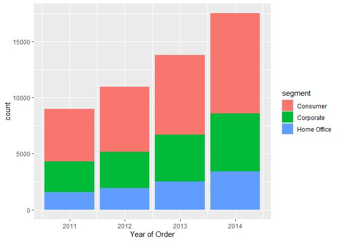
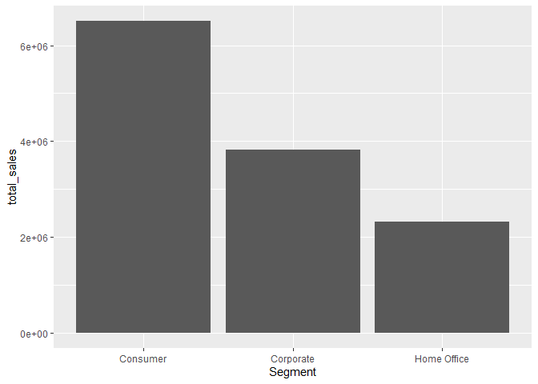
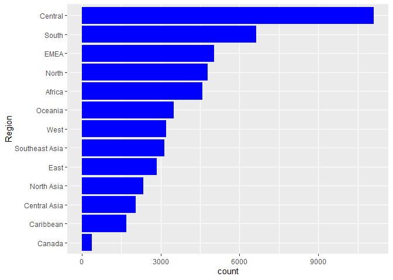
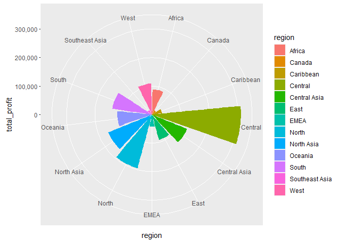
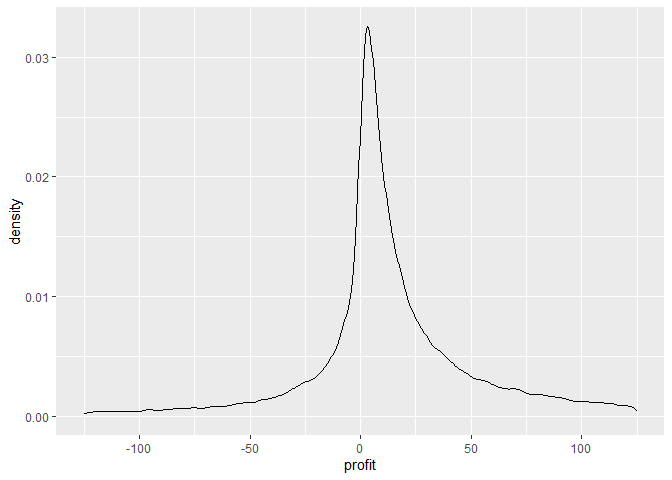

Sp23_Mulla_Assignment_02
================
Areej Mulla
2/16/2023

``` r
library(readr)
```

    ## Warning: package 'readr' was built under R version 4.1.3

``` r
SuperStoreOrders <- read_csv(paste0(getwd(), "/Project02_SuperStoreOrders.csv"))
```

    ## Rows: 51290 Columns: 21
    ## -- Column specification --------------------------------------------------------
    ## Delimiter: ","
    ## chr (15): order_id, order_date, ship_date, ship_mode, customer_name, segment...
    ## dbl  (5): quantity, discount, profit, shipping_cost, year
    ## num  (1): sales
    ## 
    ## i Use `spec()` to retrieve the full column specification for this data.
    ## i Specify the column types or set `show_col_types = FALSE` to quiet this message.

**Question 1** <br> The data set illustrates no missing values and
includes 51290 records. sales, quantity, discount, profit,
shipping_cost, order_priority and year are all numeric variables, while
the rest are character variables.

``` r
summary(SuperStoreOrders)
```

    ##    order_id          order_date         ship_date          ship_mode        
    ##  Length:51290       Length:51290       Length:51290       Length:51290      
    ##  Class :character   Class :character   Class :character   Class :character  
    ##  Mode  :character   Mode  :character   Mode  :character   Mode  :character  
    ##                                                                             
    ##                                                                             
    ##                                                                             
    ##  customer_name        segment             state             country         
    ##  Length:51290       Length:51290       Length:51290       Length:51290      
    ##  Class :character   Class :character   Class :character   Class :character  
    ##  Mode  :character   Mode  :character   Mode  :character   Mode  :character  
    ##                                                                             
    ##                                                                             
    ##                                                                             
    ##     market             region           product_id          category        
    ##  Length:51290       Length:51290       Length:51290       Length:51290      
    ##  Class :character   Class :character   Class :character   Class :character  
    ##  Mode  :character   Mode  :character   Mode  :character   Mode  :character  
    ##                                                                             
    ##                                                                             
    ##                                                                             
    ##  sub_category       product_name           sales            quantity     
    ##  Length:51290       Length:51290       Min.   :    0.0   Min.   : 1.000  
    ##  Class :character   Class :character   1st Qu.:   31.0   1st Qu.: 2.000  
    ##  Mode  :character   Mode  :character   Median :   85.0   Median : 3.000  
    ##                                        Mean   :  246.5   Mean   : 3.477  
    ##                                        3rd Qu.:  251.0   3rd Qu.: 5.000  
    ##                                        Max.   :22638.0   Max.   :14.000  
    ##     discount          profit         shipping_cost    order_priority    
    ##  Min.   :0.0000   Min.   :-6599.98   Min.   :  0.00   Length:51290      
    ##  1st Qu.:0.0000   1st Qu.:    0.00   1st Qu.:  2.61   Class :character  
    ##  Median :0.0000   Median :    9.24   Median :  7.79   Mode  :character  
    ##  Mean   :0.1429   Mean   :   28.64   Mean   : 26.38                     
    ##  3rd Qu.:0.2000   3rd Qu.:   36.81   3rd Qu.: 24.45                     
    ##  Max.   :0.8500   Max.   : 8399.98   Max.   :933.57                     
    ##       year     
    ##  Min.   :2011  
    ##  1st Qu.:2012  
    ##  Median :2013  
    ##  Mean   :2013  
    ##  3rd Qu.:2014  
    ##  Max.   :2014

``` r
library(ggplot2)
```

    ## Warning: package 'ggplot2' was built under R version 4.1.3

**Question 2** <br> The number of orders for each of the segments is
increasing over the years, with the consumer segment illustrating the
largest number of orders in each year.

``` r
layer1 <- ggplot(data = SuperStoreOrders)
layer1 +
  geom_bar(aes(x = year , fill = segment)) +
  xlab("Year of Order")
```

<!-- -->

**Question 3** <br> The bar chart below illustrates that the consumer
segment is the best seller.

``` r
library(dplyr) 
```

    ## Warning: package 'dplyr' was built under R version 4.1.3

    ## 
    ## Attaching package: 'dplyr'

    ## The following objects are masked from 'package:stats':
    ## 
    ##     filter, lag

    ## The following objects are masked from 'package:base':
    ## 
    ##     intersect, setdiff, setequal, union

``` r
SuperStoreOrders %>% 
  mutate(total_sales = sum(sales)) %>%
  group_by(segment) %>%
  summarize(total_sales = sum(sales)) %>%
ggplot() +
  geom_bar(aes(x = segment, y = total_sales), stat = "identity") +
  scale_x_discrete(name = "Segment") 
```

<!-- -->
**Question 4** <br> The bar chart below illustrates that the Central
region receives the most orders, while the region of Canada receives the
fewest orders.

``` r
layer1 + 
  geom_bar(mapping = aes(x = reorder(region, region, 
                                     FUN = function(x) length(x))), 
                         fill = "blue")+
  coord_flip() +
   scale_x_discrete(name = "Region")
```

<!-- -->
**Question 5** <br>

``` r
SuperStoreOrders %>% 
  mutate(total_profit = sum(profit)) %>%
  group_by(region) %>%
  summarize(total_profit = sum(profit)) %>%
  ggplot() +  geom_bar(mapping = aes(x = region, y = total_profit,
                                     fill = region),
                                      stat = "identity") +
  coord_polar() + scale_y_continuous(labels = scales::comma_format()) 
```

<!-- -->
**Question 6** <br> The density plot below illustrates a net positive
profit.

``` r
layer1 +
  geom_density(aes(x = profit)) + 
  scale_x_continuous(limits = c(-125, 125))
```

    ## Warning: Removed 6425 rows containing non-finite values (`stat_density()`).

<!-- -->

**Honors Pledge:**

**As a student of the Dr. Robert B. Pamplin Jr. School of Business I
have read and strive to uphold the University’s Code of Academic
Integrity and promote ethical behavior. In doing so, I pledge on my
honor that I have not given, received, or used any unauthorized
materials or assistance on this examination or assignment. I further
pledge that I have not engaged in cheating, forgery, or plagiarism and I
have cited all appropriate sources.**

Student Signature: Areej Mulla
