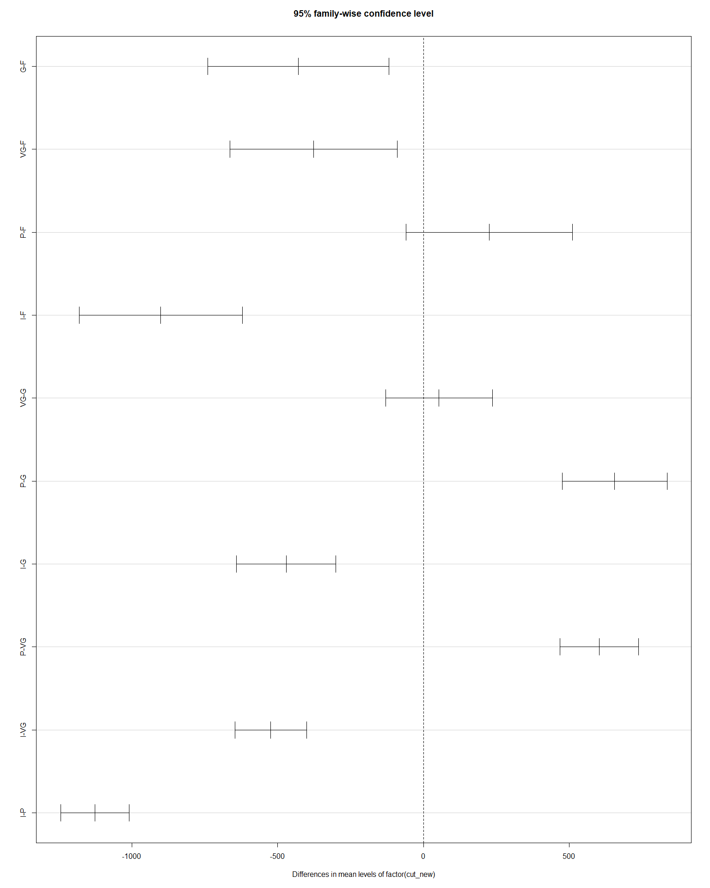
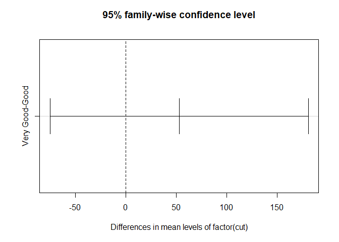
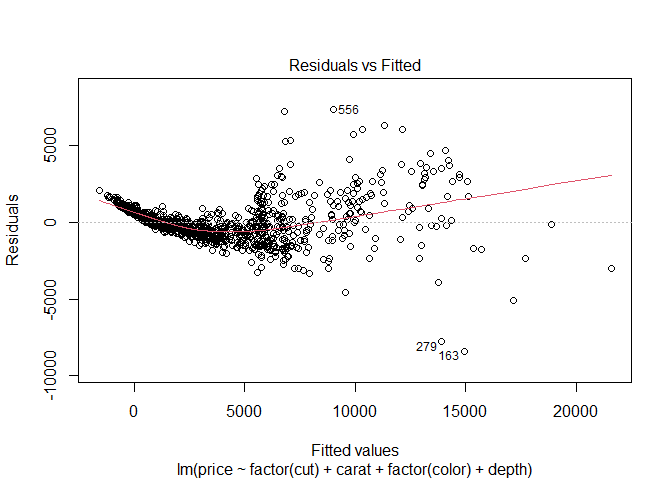
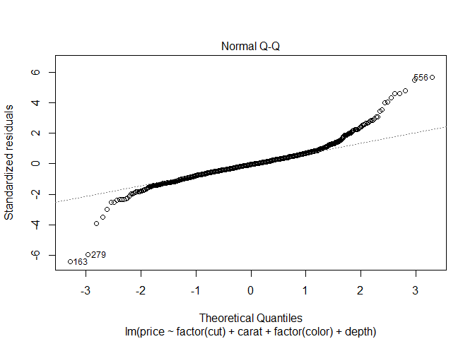
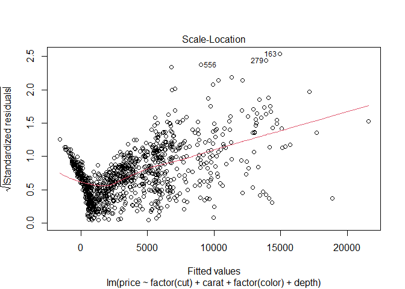
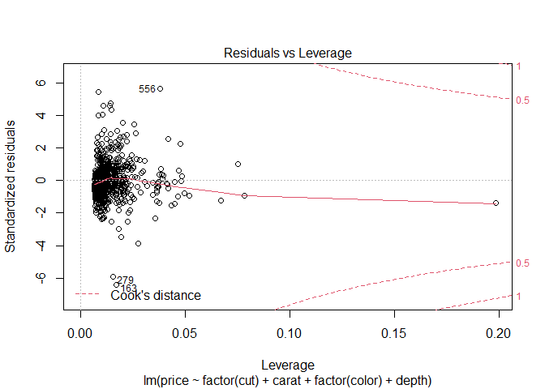

sp23_Assignment_3
================
Areej Mulla
3/15/2023

``` r
library(tidyverse)
```

    ## Warning: package 'tidyverse' was built under R version 4.1.3

    ## -- Attaching packages --------------------------------------- tidyverse 1.3.2 --
    ## v ggplot2 3.4.0     v purrr   1.0.1
    ## v tibble  3.1.8     v dplyr   1.1.0
    ## v tidyr   1.3.0     v stringr 1.5.0
    ## v readr   2.1.4     v forcats 1.0.0

    ## Warning: package 'ggplot2' was built under R version 4.1.3

    ## Warning: package 'tibble' was built under R version 4.1.3

    ## Warning: package 'tidyr' was built under R version 4.1.3

    ## Warning: package 'readr' was built under R version 4.1.3

    ## Warning: package 'purrr' was built under R version 4.1.3

    ## Warning: package 'dplyr' was built under R version 4.1.3

    ## Warning: package 'stringr' was built under R version 4.1.3

    ## Warning: package 'forcats' was built under R version 4.1.3

    ## -- Conflicts ------------------------------------------ tidyverse_conflicts() --
    ## x dplyr::filter() masks stats::filter()
    ## x dplyr::lag()    masks stats::lag()

**Question 1** <br>

``` r
oneway.test(price ~ cut,
            data = diamonds)
```

    ## 
    ##  One-way analysis of means (not assuming equal variances)
    ## 
    ## data:  price and cut
    ## F = 166.04, num df = 4.0, denom df = 9398.6, p-value < 2.2e-16

``` r
#' The p-value of < 2.2e-16 is significant (< 0.05 or lower), thus there is no evidence to confirm the null hypothesis, so we reject the null hypothesis (Ha). There is a statistically significant difference between the means of the groups.
```

**Question 2** <br>

``` r
oneway.test(price ~ cut,
            var.equal = TRUE,
            data = diamonds)
```

    ## 
    ##  One-way analysis of means
    ## 
    ## data:  price and cut
    ## F = 175.69, num df = 4, denom df = 53935, p-value < 2.2e-16

``` r
#' The p-value of < 2.2e-16 is the same and significant (< 0.05 or lower),
#' thus there is no evidence to confirm the null hypothesis, so we reject
#' the null hypothesis (Ha). There is a statistically significant difference between the means of the groups.
```

**Question 3** <br>

``` r
diamonds$cut_new <- factor(diamonds$cut, labels = c("F", "G", "VG", "P", "I"))
anova_model <- aov(price ~ factor(cut_new),
                   data = diamonds)
plot(TukeyHSD(anova_model))
```

<!-- -->

``` r
#' there is a significant difference between the group means of all cuts
#' except for "Premium" & "Fair" and "Very Good" & "Good"
```

**Question 4** <br>

``` r
#' extract the “Good” and “Very Good” diamonds
diamonds2 <- diamonds[diamonds$cut == "Good" | diamonds$cut == "Very Good",]
# or
diamonds2 <- subset(diamonds, cut == "Good" | diamonds$cut == "Very Good") 
 
# perform the one-way ANOVA
oneway.test(price ~ cut,
            var.equal = TRUE,
            data = diamonds2)
```

    ## 
    ##  One-way analysis of means
    ## 
    ## data:  price and cut
    ## F = 0.65381, num df = 1, denom df = 16986, p-value = 0.4188

``` r
#' The p-value of 0.4188 not significant (> 0.05), thus we accept
#' the null hypothesis (H0)
```

**Question 5** <br>

``` r
anova_model2 <- aov(price ~ factor(cut),
                   data = diamonds2)
plot(TukeyHSD(anova_model2))
```

<!-- -->

``` r
#' There is no significant difference between the group means of "Good" &
#' "Very Good"
```

**Question 6** <br>

``` r
#convert categorical variables into factors
model <- lm(price ~ factor(cut) + carat + factor(color) + depth,
            data = diamonds)
summary(model)
```

    ## 
    ## Call:
    ## lm(formula = price ~ factor(cut) + carat + factor(color) + depth, 
    ##     data = diamonds)
    ## 
    ## Residuals:
    ##      Min       1Q   Median       3Q      Max 
    ## -17265.2   -751.5    -83.6    544.2  12256.1 
    ## 
    ## Coefficients:
    ##                  Estimate Std. Error t value Pr(>|t|)    
    ## (Intercept)      -910.028    286.893  -3.172  0.00151 ** 
    ## factor(cut).L    1177.948     26.101  45.130  < 2e-16 ***
    ## factor(cut).Q    -491.180     22.520 -21.811  < 2e-16 ***
    ## factor(cut).C     370.862     19.151  19.365  < 2e-16 ***
    ## factor(cut)^4      85.419     15.425   5.538 3.08e-08 ***
    ## carat            8183.774     13.889 589.216  < 2e-16 ***
    ## factor(color).L -1572.449     21.727 -72.373  < 2e-16 ***
    ## factor(color).Q  -732.336     19.849 -36.896  < 2e-16 ***
    ## factor(color).C  -109.973     18.631  -5.903 3.60e-09 ***
    ## factor(color)^4    82.481     17.106   4.822 1.43e-06 ***
    ## factor(color)^5  -137.643     16.174  -8.510  < 2e-16 ***
    ## factor(color)^6  -161.317     14.672 -10.995  < 2e-16 ***
    ## depth             -35.979      4.602  -7.819 5.43e-15 ***
    ## ---
    ## Signif. codes:  0 '***' 0.001 '**' 0.01 '*' 0.05 '.' 0.1 ' ' 1
    ## 
    ## Residual standard error: 1431 on 53927 degrees of freedom
    ## Multiple R-squared:  0.8713, Adjusted R-squared:  0.8713 
    ## F-statistic: 3.042e+04 on 12 and 53927 DF,  p-value: < 2.2e-16

``` r
#' the model presents a good fit with a p-value of < 2.2e-16 and 
#' F-statistic of 3.042e+04. All coefficients demonstrate
#' significant values.
```

**Question 7** <br>

``` r
min.model <- lm(price ~ 1, data = diamonds)
fwd.model <- step(min.model,
                  direction = "forward",
                  scope = (price ~
                  carat +
                  factor(cut) +
                  factor(color) +
                  factor(clarity) +
                  depth +
                  table +
                  x +
                  y +
                  z)
                  )
```

    ## Start:  AIC=894477.9
    ## price ~ 1
    ## 
    ##                   Df  Sum of Sq        RSS    AIC
    ## + carat            1 7.2913e+11 1.2935e+11 792389
    ## + x                1 6.7152e+11 1.8695e+11 812259
    ## + y                1 6.4296e+11 2.1552e+11 819929
    ## + z                1 6.3677e+11 2.2170e+11 821454
    ## + factor(color)    6 2.6849e+10 8.3162e+11 892776
    ## + factor(clarity)  7 2.3308e+10 8.3517e+11 893007
    ## + table            1 1.3876e+10 8.4460e+11 893601
    ## + factor(cut)      4 1.1042e+10 8.4743e+11 893788
    ## + depth            1 9.7323e+07 8.5838e+11 894474
    ## <none>                          8.5847e+11 894478
    ## 
    ## Step:  AIC=792389.4
    ## price ~ carat
    ## 
    ##                   Df  Sum of Sq        RSS    AIC
    ## + factor(clarity)  7 3.9082e+10 9.0264e+10 772998
    ## + factor(color)    6 1.2561e+10 1.1678e+11 786891
    ## + factor(cut)      4 6.1332e+09 1.2321e+11 789777
    ## + x                1 3.5206e+09 1.2583e+11 790903
    ## + z                1 2.8493e+09 1.2650e+11 791190
    ## + table            1 1.4377e+09 1.2791e+11 791789
    ## + y                1 1.2425e+09 1.2810e+11 791871
    ## + depth            1 1.1546e+09 1.2819e+11 791908
    ## <none>                          1.2935e+11 792389
    ## 
    ## Step:  AIC=772998.5
    ## price ~ carat + factor(clarity)
    ## 
    ##                 Df  Sum of Sq        RSS    AIC
    ## + factor(color)  6 1.6402e+10 7.3862e+10 762193
    ## + x              1 1.8542e+09 8.8410e+10 771881
    ## + factor(cut)    4 1.7808e+09 8.8483e+10 771932
    ## + z              1 1.4814e+09 8.8783e+10 772108
    ## + y              1 7.4127e+08 8.9523e+10 772556
    ## + table          1 3.7751e+08 8.9886e+10 772774
    ## + depth          1 3.5822e+08 8.9906e+10 772786
    ## <none>                        9.0264e+10 772998
    ## 
    ## Step:  AIC=762193.4
    ## price ~ carat + factor(clarity) + factor(color)
    ## 
    ##               Df  Sum of Sq        RSS    AIC
    ## + x            1 2733710969 7.1128e+10 760161
    ## + z            1 1842294631 7.2020e+10 760833
    ## + factor(cut)  4 1699187372 7.2163e+10 760946
    ## + y            1 1145039064 7.2717e+10 761353
    ## + table        1  409645878 7.3452e+10 761895
    ## + depth        1  174658715 7.3687e+10 762068
    ## <none>                      7.3862e+10 762193
    ## 
    ## Step:  AIC=760161.1
    ## price ~ carat + factor(clarity) + factor(color) + x
    ## 
    ##               Df  Sum of Sq        RSS    AIC
    ## + factor(cut)  4 1918248123 6.9210e+10 758694
    ## + depth        1  722282102 7.0406e+10 759613
    ## + table        1  273738191 7.0855e+10 759955
    ## + z            1  199547343 7.0929e+10 760012
    ## + y            1    5354253 7.1123e+10 760159
    ## <none>                      7.1128e+10 760161
    ## 
    ## Step:  AIC=758694.4
    ## price ~ carat + factor(clarity) + factor(color) + x + factor(cut)
    ## 
    ##         Df Sum of Sq        RSS    AIC
    ## + depth  1 244682865 6.8965e+10 758505
    ## + z      1  72666922 6.9137e+10 758640
    ## + table  1   9935285 6.9200e+10 758689
    ## <none>               6.9210e+10 758694
    ## + y      1    982101 6.9209e+10 758696
    ## 
    ## Step:  AIC=758505.4
    ## price ~ carat + factor(clarity) + factor(color) + x + factor(cut) + 
    ##     depth
    ## 
    ##         Df Sum of Sq        RSS    AIC
    ## + table  1 105497218 6.8860e+10 758425
    ## <none>               6.8965e+10 758505
    ## + z      1   2323719 6.8963e+10 758506
    ## + y      1    298553 6.8965e+10 758507
    ## 
    ## Step:  AIC=758424.8
    ## price ~ carat + factor(clarity) + factor(color) + x + factor(cut) + 
    ##     depth + table
    ## 
    ##        Df Sum of Sq        RSS    AIC
    ## + z     1   2662170 6.8857e+10 758425
    ## <none>              6.8860e+10 758425
    ## + y     1    116788 6.8860e+10 758427
    ## 
    ## Step:  AIC=758424.7
    ## price ~ carat + factor(clarity) + factor(color) + x + factor(cut) + 
    ##     depth + table + z
    ## 
    ##        Df Sum of Sq        RSS    AIC
    ## <none>              6.8857e+10 758425
    ## + y     1    315487 6.8857e+10 758426

``` r
#' the best model is price ~ carat + clarity + color + x + cut + depth +
#' table + z, with the lowest AIC of 758424.7

# print the summary of the best fit model
summary(fwd.model)
```

    ## 
    ## Call:
    ## lm(formula = price ~ carat + factor(clarity) + factor(color) + 
    ##     x + factor(cut) + depth + table + z, data = diamonds)
    ## 
    ## Residuals:
    ##      Min       1Q   Median       3Q      Max 
    ## -21378.8   -592.5   -183.5    376.3  10694.1 
    ## 
    ## Coefficients:
    ##                    Estimate Std. Error  t value Pr(>|t|)    
    ## (Intercept)        5768.782    395.474   14.587  < 2e-16 ***
    ## carat             11257.752     48.602  231.630  < 2e-16 ***
    ## factor(clarity).L  4097.613     30.256  135.431  < 2e-16 ***
    ## factor(clarity).Q -1925.133     28.226  -68.205  < 2e-16 ***
    ## factor(clarity).C   982.322     24.150   40.676  < 2e-16 ***
    ## factor(clarity)^4  -364.976     19.285  -18.926  < 2e-16 ***
    ## factor(clarity)^5   233.635     15.751   14.833  < 2e-16 ***
    ## factor(clarity)^6     6.871     13.715    0.501  0.61640    
    ## factor(clarity)^7    90.622     12.103    7.487 7.13e-14 ***
    ## factor(color).L   -1952.179     17.342 -112.572  < 2e-16 ***
    ## factor(color).Q    -672.075     15.777  -42.599  < 2e-16 ***
    ## factor(color).C    -165.277     14.725  -11.224  < 2e-16 ***
    ## factor(color)^4      38.193     13.526    2.824  0.00475 ** 
    ## factor(color)^5     -95.780     12.776   -7.497 6.64e-14 ***
    ## factor(color)^6     -48.452     11.614   -4.172 3.02e-05 ***
    ## x                 -1000.354     28.795  -34.740  < 2e-16 ***
    ## factor(cut).L       584.600     22.476   26.010  < 2e-16 ***
    ## factor(cut).Q      -302.211     17.983  -16.805  < 2e-16 ***
    ## factor(cut).C       148.446     15.461    9.601  < 2e-16 ***
    ## factor(cut)^4       -20.619     12.371   -1.667  0.09559 .  
    ## depth               -64.003      4.517  -14.168  < 2e-16 ***
    ## table               -26.501      2.911   -9.103  < 2e-16 ***
    ## z                   -47.925     33.194   -1.444  0.14880    
    ## ---
    ## Signif. codes:  0 '***' 0.001 '**' 0.01 '*' 0.05 '.' 0.1 ' ' 1
    ## 
    ## Residual standard error: 1130 on 53917 degrees of freedom
    ## Multiple R-squared:  0.9198, Adjusted R-squared:  0.9198 
    ## F-statistic: 2.81e+04 on 22 and 53917 DF,  p-value: < 2.2e-16

Regress “price” on 4 variables, cut, carat, color, and depth. Draw the
diagnostic plots for a sample of 1000 observations of the diamonds
dataset.

**Question 8** <br>

``` r
sample <- diamonds[sample(1:53940, 1000), ]
model <- lm(price ~ factor(cut) + carat + factor(color) + depth,
            data = sample)
plot(model)
```

<!-- --><!-- --><!-- --><!-- -->

**Honors Pledge:**

**As a student of the Dr. Robert B. Pamplin Jr. School of Business I
have read and strive to uphold the University’s Code of Academic
Integrity and promote ethical behavior. In doing so, I pledge on my
honor that I have not given, received, or used any unauthorized
materials or assistance on this examination or assignment. I further
pledge that I have not engaged in cheating, forgery, or plagiarism and I
have cited all appropriate sources.**

Student Signature: Areej Mulla
