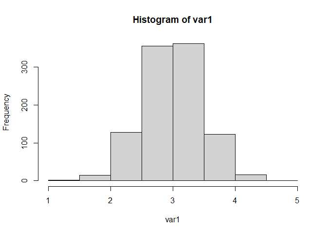
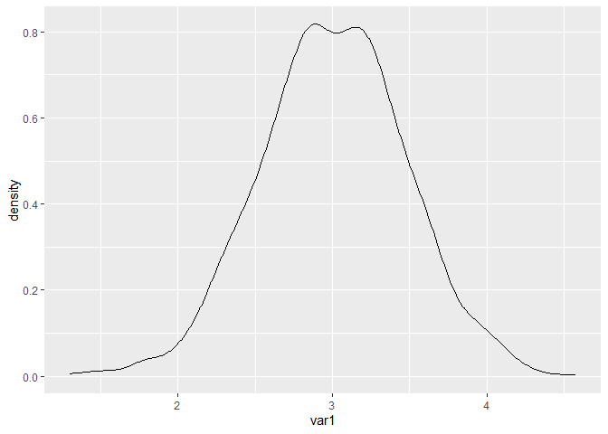
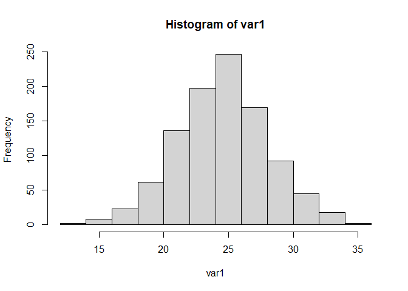
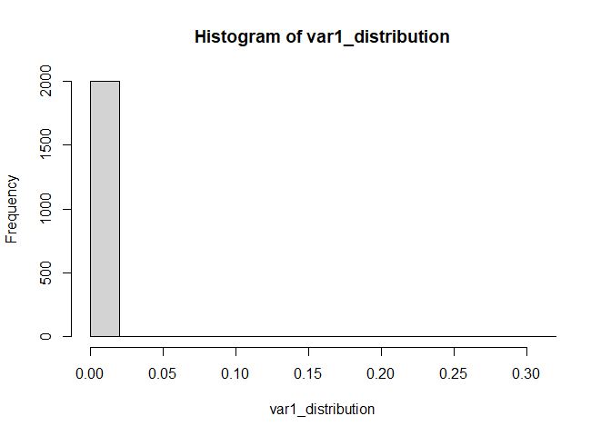

ANOVA and Regression
================
Areej Mulla
2023-03-16

## Probability Distribution Functions

-   Normal Distribution

**Q1. Please write in your own words what is the purpose of each of the
below functions.** <br> - rnorm()

``` r
# rnorm generates random deviates 
var1 <- rnorm(1000, mean = 3, sd = 0.5)
hist(var1)
library(ggplot2)
```

    ## Warning: package 'ggplot2' was built under R version 4.1.3

<!-- -->

``` r
ggplot(data = as.data.frame(var1)) +
  geom_density(aes(x = var1))
```

<!-- -->

-   dnorm()

``` r
# dnorm provides the density point
dnorm(3, mean = 3, sd = 0.5)
```

    ## [1] 0.7978846

-   pnorm()

``` r
# pnorm gives the distribution function (at what proportion we have the qnorm value)
# returns a proportion of values
pnorm(2.662755, mean = 3, sd = 0.5)
```

    ## [1] 0.2499999

-   qnorm()

``` r
# qnorm gives the quantile function
qnorm(0.5, mean = 3, sd = 0.5, lower.tail = TRUE, log.p = FALSE)
```

    ## [1] 3

``` r
qnorm(0.25, mean = 3, sd = 0.5)
```

    ## [1] 2.662755

``` r
# Create a vector of 1000 random normal numbers with a mean of 5 and standard deviation of 1.5. Name this as human_water_consumption. Assuming that this 1000 sample vector is taken from the global water consumption vector.  
human_water_consumption <- c(rnorm(1000, mean = 5, sd = 1.5))

# Plot the normal distribution as a density plot
ggplot(data = as.data.frame(human_water_consumption)) +
  geom_density(aes(x = human_water_consumption))
```

<!-- -->

``` r
# What is the global water consumption density for 1 liter of water? 
dnorm(1,  mean = 5, sd = 1.5)
```

    ## [1] 0.007597324

``` r
# What is the global water consumption density for 5 liters of water? 
dnorm(5,  mean = 5, sd = 1.5)
```

    ## [1] 0.2659615

``` r
# Which density value is high? Provide your interpretation. 
#' The one with global water consumption density of 5 liters of water (density = 0.2659615), because 5 is the mean.
```

``` r
# What is the average water consumption of bottom 25% of population?  
qnorm(0.25, mean = 5, sd = 1.5)
```

    ## [1] 3.988265

``` r
# What is the water consumption of top 25% of population?  
qnorm1 <- qnorm(0.25, mean = 5, sd = 1.5)
qnorm2 <- 1 - qnorm1
```

``` r
# rbinom provides two possibilities S/F

var1 <- rbinom(1000, 10, 0.2)
head(var1, 10)
```

    ##  [1] 1 4 3 2 1 2 2 4 0 3

``` r
# [1] 1 1 1 4 2 2 2 3 3 3  -> provides number of successes in each trial

var1 <- rbinom(1000, 10, 0.8)
head(var1, 10)
```

    ##  [1] 8 8 9 8 8 8 9 5 9 8

``` r
# [1]  9  8  4  8 10 10  9  9  9  9 -> we observe higher values (# of successes)

var1 <- rbinom(1000, 50, 0.5)
hist(var1)
```

<!-- -->

``` r
vary_success_rate <- seq(1, 2000, 1)
var1_distribution <- dbinom(vary_success_rate,
                            size = 5,
                            0.5)
hist(var1_distribution)
```

<!-- -->

``` r
# What percentage of population drinks less than 2 liters of water a day?   
pnorm(2, mean = 5, sd = 1.5)
```

    ## [1] 0.02275013

``` r
# What proportion of the population consumes 7 liters or more of water per day?
pnorm1 <- pnorm(7, mean = 5, sd = 1.5)
pnorm2 <- 1 - pnorm1
```

``` r
# Create a 100-person sample from a group of sports bettors predicting the number of titles Andy Murray will win in the next 10 tournaments. Assume that his current title-winning percentage is 0.25. Save the output to murray_win_rate and print the first 10 elements. 
murray_win_rate1 <- rbinom(100, 10, 0.25)
head(murray_win_rate1 ,10)
```

    ##  [1] 2 1 5 3 0 3 0 2 3 2

``` r
# Create a histogram using the murray_win_rate sample prediction.
hist(murray_win_rate1)
```

<!-- -->

``` r
# Re-create the murray_win_rate vector, but this time, increase the size from 100 to 10000 leaving the win-rate and the number of tournaments the same. 
murray_win_rate2 <- rbinom(10000, 10, 0.25)

# Create a histogram using the 10,000 sample vector
hist(murray_win_rate2)
```

<!-- -->

``` r
# What do you observe? Hint: Central Limit Theorem (This time the distribution is not normal distribution but a Binomial Distribution)
#' The histograms are similar, because the sample size doesn't impact
#' the distribution, the number of trials does. Both histograms illustrate 
#' a distribution that is skewed to the right.
```

``` r
# Sitting in your car for over a hundred days, you observe how quickly you would be able to pass the red light. Your observation revealed that, on average, five vehicles could easily pass the signal. 
# Someone in your circle told you that the there is a high chance that if we randomly observe more number of vehicles up to 40, then there is a high chance that more number of vehicles will go through the signal. You would like to show them the densities plot of Poisson distribution. Poisson distribution differs slightly from Normal Distribution. Plot the poisson densities with a mean of five for samples ranging in size from one to forty.

# Create a vector of sample sizes ranging from 1 to 40 incrementing by 1. 
pois_sample <- seq(1, 40, 1)

# Capture Poisson densities for these 40 samples. Hint: Use dpois() function. You need to pass the sample size and the sample mean of 5 cars. 
var1 <- dpois(pois_sample, 5)

# Draw the Poisson densities plot
ggplot(data = as.data.frame(var1)) +
  geom_line(aes(x = pois_sample , y = var1))
```

<!-- -->

``` r
# Please provide interpretations for the below plots. 
library(ggplot2)
success_samples <- seq(1, 40, 1)
densities_with_mean1 <- dpois(success_samples, 1)
densities_with_mean5 <- dpois(success_samples, 5)
densities_with_mean10 <- dpois(success_samples, 10)
densities_with_mean20 <- dpois(success_samples, 20)

ggplot(data.frame(x = success_samples), aes(x)) +
  geom_line(aes(y=densities_with_mean1), colour = "red") +
  geom_line(aes(y=densities_with_mean5), colour = "blue") +
  geom_line(aes(y=densities_with_mean10), colour = "green") +
  geom_line(aes(y=densities_with_mean20), colour = "purple")
```

<!-- -->

``` r
#' As the lambda increases the distribution looks more like
#' a normal distribution. Regression works with large lambda.
```

## ANOVA - Analysis of variance

``` r
#### class example (Garlic Bulbs)

library(readr)
```

    ## Warning: package 'readr' was built under R version 4.1.3

``` r
garlicBulbs <- read_csv(paste0(getwd(), "/GarlicBulbSizes.csv"))
```

    ## Rows: 32 Columns: 3
    ## -- Column specification --------------------------------------------------------
    ## Delimiter: ","
    ## dbl (3): BulbId, BulbType, BulbSize
    ## 
    ## i Use `spec()` to retrieve the full column specification for this data.
    ## i Specify the column types or set `show_col_types = FALSE` to quiet this message.

``` r
unique(garlicBulbs$BulbType)
```

    ## [1] 1 2 3 4

``` r
ggplot( data = garlicBulbs) +
  geom_boxplot(aes(x = BulbSize)) +
  facet_grid(~BulbType) +
  coord_flip()
```

<!-- -->

``` r
# plot the group means
groupMeans <- split(garlicBulbs$BulbSize,
      garlicBulbs$BulbType)

means_ofgarlic_bulbs <- sapply(groupMeans, mean)

boxplot(BulbSize ~ BulbType,
        data = garlicBulbs)
points(means_ofgarlic_bulbs, col = "blue",
       pch = 16)
```

<!-- -->

``` r
#### types of apply class functions
#' lapply
#' sapply: simplified version to extract vector
#' tapply: table apply (apply specific function vector by category)
#' mapply: multivariate version of apply

#### tapply example
# rep_len is to repeat a range of numbers a certain number of times
n <- 17
fac <- factor(rep_len(1:3, n), levels = 1:5)
tapply(1:n, fac, sum)
```

    ##  1  2  3  4  5 
    ## 51 57 45 NA NA

``` r
tapply(garlicBulbs$BulbSize,
       garlicBulbs$BulbType,
       mean)
```

    ##         1         2         3         4 
    ## 0.2353998 0.2051141 0.2424075 0.1737649

``` r
# perform one.way ANOVA 
oneway.test(BulbSize ~ BulbType,
            data = garlicBulbs)
```

    ## 
    ##  One-way analysis of means (not assuming equal variances)
    ## 
    ## data:  BulbSize and BulbType
    ## F = 5.3593, num df = 3.000, denom df = 15.089, p-value = 0.01032

``` r
# p-value is crucial here
# p-value is significant, thus we reject the null hypothesis

#### running the hypothesis test:
#' null hypothesis:
#' H0: there's no significant difference. All the means are the same
#' alternative hypothesis:
#' Ha: there's no evidence to confirm that the means are the same
#' Ha: reject null hypothesis if p-value is significant

# plot the model
anova_model <- aov(BulbSize ~ factor(BulbType),
                   data = garlicBulbs)
plot(TukeyHSD(anova_model))
```

<!-- -->

``` r
# we can see that 4 and 3 and 4 & 1 are significantly different

#### GSPC_df example

# Read the S&P returns data - GSPF_df. Load the RData to create this dataframe. 
load("anova.rdata")

# Use only the first 2500 observations. 
# Perform one.way ANOVA between the 12 months of returns data.
GSPC_df <- GSPC_df[1:2500,]
oneway.test(r ~ mon,
            data = GSPC_df)
```

    ## 
    ##  One-way analysis of means (not assuming equal variances)
    ## 
    ## data:  r and mon
    ## F = 2.0085, num df = 11.00, denom df = 976.14, p-value = 0.02478

``` r
# plot the model
anova_model_GSPC <- aov(r ~ factor(mon),
                   data = GSPC_df)
plot(TukeyHSD(anova_model_GSPC))
```

<!-- -->

``` r
# with regression we capture the accuracy by correctly classifying the labels

library(readr)
carSales <- read_csv(paste0(getwd(), "/Car_sales.csv"))
```

    ## Rows: 157 Columns: 13
    ## -- Column specification --------------------------------------------------------
    ## Delimiter: ","
    ## chr  (1): Vehicle_type
    ## dbl (12): Sales_in_thousands, Resale_value, Price_in_thousands, Engine_size,...
    ## 
    ## i Use `spec()` to retrieve the full column specification for this data.
    ## i Specify the column types or set `show_col_types = FALSE` to quiet this message.

``` r
#### if:
#' 140 train, Sq Error = 100
#' 17 test, Sq close to 100
#' then the model is good

#### some metrics
# root square mean error
# r^2

# we need to eliminate NAs
# we need to make sure there's a linear relationship by using correlation

summary(carSales)
```

    ##  Sales_in_thousands  Resale_value   Vehicle_type       Price_in_thousands
    ##  Min.   :  0.11     Min.   : 5.16   Length:157         Min.   : 9.235    
    ##  1st Qu.: 14.11     1st Qu.:11.26   Class :character   1st Qu.:18.017    
    ##  Median : 29.45     Median :14.18   Mode  :character   Median :22.799    
    ##  Mean   : 53.00     Mean   :18.07                      Mean   :27.391    
    ##  3rd Qu.: 67.96     3rd Qu.:19.88                      3rd Qu.:31.948    
    ##  Max.   :540.56     Max.   :67.55                      Max.   :85.500    
    ##                     NA's   :36                         NA's   :2         
    ##   Engine_size      Horsepower      Wheelbase         Width      
    ##  Min.   :1.000   Min.   : 55.0   Min.   : 92.6   Min.   :62.60  
    ##  1st Qu.:2.300   1st Qu.:149.5   1st Qu.:103.0   1st Qu.:68.40  
    ##  Median :3.000   Median :177.5   Median :107.0   Median :70.55  
    ##  Mean   :3.061   Mean   :185.9   Mean   :107.5   Mean   :71.15  
    ##  3rd Qu.:3.575   3rd Qu.:215.0   3rd Qu.:112.2   3rd Qu.:73.42  
    ##  Max.   :8.000   Max.   :450.0   Max.   :138.7   Max.   :79.90  
    ##  NA's   :1       NA's   :1       NA's   :1       NA's   :1      
    ##      Length       Curb_weight    Fuel_capacity   Fuel_efficiency
    ##  Min.   :149.4   Min.   :1.895   Min.   :10.30   Min.   :15.00  
    ##  1st Qu.:177.6   1st Qu.:2.971   1st Qu.:15.80   1st Qu.:21.00  
    ##  Median :187.9   Median :3.342   Median :17.20   Median :24.00  
    ##  Mean   :187.3   Mean   :3.378   Mean   :17.95   Mean   :23.84  
    ##  3rd Qu.:196.1   3rd Qu.:3.800   3rd Qu.:19.57   3rd Qu.:26.00  
    ##  Max.   :224.5   Max.   :5.572   Max.   :32.00   Max.   :45.00  
    ##  NA's   :1       NA's   :2       NA's   :1       NA's   :3      
    ##  Power_perf_factor
    ##  Min.   : 23.28   
    ##  1st Qu.: 60.41   
    ##  Median : 72.03   
    ##  Mean   : 77.04   
    ##  3rd Qu.: 89.41   
    ##  Max.   :188.14   
    ##  NA's   :2

``` r
# identify all NA values
nrow(carSales[complete.cases(carSales), ])
```

    ## [1] 117

``` r
# drop categorical IV from input dataset
carSales <- carSales[, -3]

# impute means for continuous variables (replace NA values with the mean value)
summary(ifelse(is.na(carSales$Resale_value),
       mean(carSales$Resale_value, na.rm = T), 
       carSales$Resale_value)) # use the code below
```

    ##    Min. 1st Qu.  Median    Mean 3rd Qu.    Max. 
    ##    5.16   12.54   17.71   18.07   18.14   67.55

``` r
# apply the imputation to all columns
impute_means <- function(x) {
  ifelse(is.na(x),
       mean(x, na.rm = T), 
       x)
}

# sapply(carSales, FUN = function(x) {
# mean(x, na.rm = T)
# }
# )

carSales <- as.data.frame(sapply(carSales, impute_means))

# create a correlation matrix
correlation_matrix <- as.data.frame(cor(carSales))

# another way to create a correlation matrix
library(magrittr)
```

    ## Warning: package 'magrittr' was built under R version 4.1.3

``` r
View(carSales %>%
  cor() %>%
  as.data.frame())

# create a correlation matrix in a csv format
write.csv(carSales %>%
  cor() %>%
  as.data.frame(),
  "correlation_matrix.csv")

# regression analysis
model <- lm(Price_in_thousands ~ .,
            data = carSales)
summary(model)
```

    ## 
    ## Call:
    ## lm(formula = Price_in_thousands ~ ., data = carSales)
    ## 
    ## Residuals:
    ##     Min      1Q  Median      3Q     Max 
    ## -2.8187 -0.8509 -0.2118  0.4234 24.8676 
    ## 
    ## Coefficients:
    ##                     Estimate Std. Error t value Pr(>|t|)    
    ## (Intercept)        -1.963969   6.579387  -0.299  0.76575    
    ## Sales_in_thousands -0.002139   0.003533  -0.605  0.54584    
    ## Resale_value        0.115321   0.036679   3.144  0.00202 ** 
    ## Engine_size        -1.210807   0.477745  -2.534  0.01232 *  
    ## Horsepower         -0.648834   0.034312 -18.910  < 2e-16 ***
    ## Wheelbase           0.011516   0.058563   0.197  0.84438    
    ## Width              -0.105120   0.101892  -1.032  0.30394    
    ## Length             -0.037419   0.031435  -1.190  0.23584    
    ## Curb_weight         2.573305   0.848156   3.034  0.00286 ** 
    ## Fuel_capacity      -0.001394   0.116240  -0.012  0.99045    
    ## Fuel_efficiency     0.196395   0.094757   2.073  0.03998 *  
    ## Power_perf_factor   1.968250   0.081177  24.246  < 2e-16 ***
    ## ---
    ## Signif. codes:  0 '***' 0.001 '**' 0.01 '*' 0.05 '.' 0.1 ' ' 1
    ## 
    ## Residual standard error: 2.489 on 145 degrees of freedom
    ## Multiple R-squared:  0.9717, Adjusted R-squared:  0.9695 
    ## F-statistic: 452.2 on 11 and 145 DF,  p-value: < 2.2e-16

``` r
#' Price_in_thousands =  -1.963969  + (-0.002139 * Sales_in_thousands
#' + 0.115321 * Resale_value + ... + Error)

# deal with insignificant variables (analyzing models using AIC)
# the lower the AIC the better the model
# refer to R Cookbook for forward pass and backward model selection
min.model <- lm(Price_in_thousands ~ 1, data = carSales)
fwd.model <- step(min.model,
                  direction = "forward",
                  scope = (Price_in_thousands ~
                  Sales_in_thousands +
                  Resale_value +
                  Engine_size +
                  Horsepower +
                  Wheelbase +
                  Width +
                  Length +
                  Curb_weight +
                  Fuel_capacity +
                  Fuel_efficiency +
                  Power_perf_factor)
                  )
```

    ## Start:  AIC=835.42
    ## Price_in_thousands ~ 1
    ## 
    ##                      Df Sum of Sq   RSS    AIC
    ## + Power_perf_factor   1   25575.5  6144 579.71
    ## + Horsepower          1   22298.7  9421 646.82
    ## + Resale_value        1   21452.9 10267 660.32
    ## + Engine_size         1   12463.4 19256 759.07
    ## + Curb_weight         1    8701.2 23018 787.08
    ## + Fuel_efficiency     1    7662.2 24057 794.02
    ## + Fuel_capacity       1    5681.7 26038 806.44
    ## + Width               1    3435.6 28284 819.43
    ## + Sales_in_thousands  1    2939.4 28780 822.16
    ## + Length              1     780.6 30939 833.51
    ## <none>                            31719 835.42
    ## + Wheelbase           1     387.4 31332 835.50
    ## 
    ## Step:  AIC=579.71
    ## Price_in_thousands ~ Power_perf_factor
    ## 
    ##                      Df Sum of Sq    RSS    AIC
    ## + Horsepower          1    5012.7 1131.2 316.04
    ## + Resale_value        1    1695.1 4448.8 531.03
    ## + Engine_size         1    1123.2 5020.7 550.02
    ## + Length              1     939.5 5204.4 555.66
    ## + Width               1     733.5 5410.4 561.75
    ## + Wheelbase           1     505.3 5638.5 568.24
    ## + Sales_in_thousands  1     362.1 5781.7 572.18
    ## + Fuel_efficiency     1     142.4 6001.5 578.03
    ## <none>                            6143.9 579.71
    ## + Fuel_capacity       1      30.3 6113.5 580.94
    ## + Curb_weight         1      23.4 6120.5 581.11
    ## 
    ## Step:  AIC=316.04
    ## Price_in_thousands ~ Power_perf_factor + Horsepower
    ## 
    ##                      Df Sum of Sq    RSS    AIC
    ## + Engine_size         1    93.323 1037.8 304.52
    ## + Resale_value        1    86.467 1044.7 305.55
    ## + Width               1    55.380 1075.8 310.16
    ## + Length              1    41.182 1090.0 312.21
    ## + Sales_in_thousands  1    37.484 1093.7 312.75
    ## + Wheelbase           1    35.607 1095.5 313.01
    ## + Fuel_efficiency     1    32.447 1098.7 313.47
    ## <none>                            1131.2 316.04
    ## + Fuel_capacity       1    12.855 1118.3 316.24
    ## + Curb_weight         1     7.405 1123.8 317.01
    ## 
    ## Step:  AIC=304.52
    ## Price_in_thousands ~ Power_perf_factor + Horsepower + Engine_size
    ## 
    ##                      Df Sum of Sq     RSS    AIC
    ## + Resale_value        1    51.072  986.77 298.60
    ## + Curb_weight         1    13.675 1024.16 304.44
    ## <none>                            1037.84 304.52
    ## + Sales_in_thousands  1    10.052 1027.79 304.99
    ## + Width               1     8.952 1028.89 305.16
    ## + Length              1     7.974 1029.86 305.31
    ## + Wheelbase           1     4.229 1033.61 305.88
    ## + Fuel_capacity       1     3.374 1034.46 306.01
    ## + Fuel_efficiency     1     0.565 1037.27 306.43
    ## 
    ## Step:  AIC=298.6
    ## Price_in_thousands ~ Power_perf_factor + Horsepower + Engine_size + 
    ##     Resale_value
    ## 
    ##                      Df Sum of Sq    RSS    AIC
    ## + Curb_weight         1   28.7422 958.02 295.95
    ## <none>                            986.77 298.60
    ## + Sales_in_thousands  1   10.0621 976.70 298.99
    ## + Fuel_capacity       1    5.0221 981.74 299.79
    ## + Width               1    2.3264 984.44 300.23
    ## + Length              1    2.2273 984.54 300.24
    ## + Fuel_efficiency     1    0.3001 986.47 300.55
    ## + Wheelbase           1    0.1858 986.58 300.57
    ## 
    ## Step:  AIC=295.95
    ## Price_in_thousands ~ Power_perf_factor + Horsepower + Engine_size + 
    ##     Resale_value + Curb_weight
    ## 
    ##                      Df Sum of Sq    RSS    AIC
    ## + Fuel_efficiency     1   21.5132 936.51 294.39
    ## + Length              1   18.5082 939.52 294.89
    ## + Width               1   17.8353 940.19 295.00
    ## + Wheelbase           1   14.7985 943.23 295.51
    ## <none>                            958.02 295.95
    ## + Sales_in_thousands  1    9.7416 948.28 296.35
    ## + Fuel_capacity       1    6.4277 951.60 296.90
    ## 
    ## Step:  AIC=294.39
    ## Price_in_thousands ~ Power_perf_factor + Horsepower + Engine_size + 
    ##     Resale_value + Curb_weight + Fuel_efficiency
    ## 
    ##                      Df Sum of Sq    RSS    AIC
    ## + Length              1   29.0227 907.49 291.45
    ## + Width               1   20.5313 915.98 292.91
    ## + Wheelbase           1   16.8024 919.71 293.55
    ## <none>                            936.51 294.39
    ## + Sales_in_thousands  1    8.9098 927.60 294.89
    ## + Fuel_capacity       1    1.1436 935.37 296.20
    ## 
    ## Step:  AIC=291.45
    ## Price_in_thousands ~ Power_perf_factor + Horsepower + Engine_size + 
    ##     Resale_value + Curb_weight + Fuel_efficiency + Length
    ## 
    ##                      Df Sum of Sq    RSS    AIC
    ## <none>                            907.49 291.45
    ## + Width               1    6.7537 900.73 292.27
    ## + Sales_in_thousands  1    2.3879 905.10 293.03
    ## + Wheelbase           1    0.1272 907.36 293.42
    ## + Fuel_capacity       1    0.0726 907.42 293.43

``` r
summary(fwd.model)
```

    ## 
    ## Call:
    ## lm(formula = Price_in_thousands ~ Power_perf_factor + Horsepower + 
    ##     Engine_size + Resale_value + Curb_weight + Fuel_efficiency + 
    ##     Length, data = carSales)
    ## 
    ## Residuals:
    ##     Min      1Q  Median      3Q     Max 
    ## -2.9304 -0.8046 -0.2364  0.4652 25.1175 
    ## 
    ## Coefficients:
    ##                   Estimate Std. Error t value Pr(>|t|)    
    ## (Intercept)       -6.31353    4.40724  -1.433  0.15409    
    ## Power_perf_factor  1.97408    0.08016  24.627  < 2e-16 ***
    ## Horsepower        -0.65026    0.03387 -19.197  < 2e-16 ***
    ## Engine_size       -1.37634    0.44871  -3.067  0.00257 ** 
    ## Resale_value       0.11772    0.03550   3.316  0.00115 ** 
    ## Curb_weight        2.52085    0.70942   3.553  0.00051 ***
    ## Fuel_efficiency    0.20129    0.08778   2.293  0.02324 *  
    ## Length            -0.04644    0.02128  -2.183  0.03061 *  
    ## ---
    ## Signif. codes:  0 '***' 0.001 '**' 0.01 '*' 0.05 '.' 0.1 ' ' 1
    ## 
    ## Residual standard error: 2.468 on 149 degrees of freedom
    ## Multiple R-squared:  0.9714, Adjusted R-squared:   0.97 
    ## F-statistic: 722.7 on 7 and 149 DF,  p-value: < 2.2e-16

``` r
#' the best model: 
#' lm(formula = Price_in_thousands ~ Power_perf_factor + Horsepower + 
#' Engine_size + Resale_value + Curb_weight + Fuel_efficiency + 
#' Length, data = carSales)
```

``` r
# Read the Melbourne Housing Prices dataset 
# Predict house prices and find the best regression fit model. 
```
